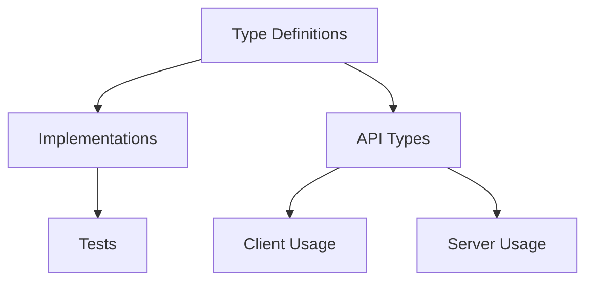

# Dash Project Alignment Tasks

## Quick Reference
- Current Task: Type System Alignment - Transport Types
- Last Completed: Gotify Transport Types (2024-01-10)
- Blocking Issues: None
- Next Up: File Transport Types
- Time Budget: 1-2 hours per task

## Task Time Estimates
- Type System Tasks: ~1 hour each
- WebSocket Tasks: ~2 hours each
- State Management: ~1.5 hours each

## Overview
This document outlines tasks for ensuring alignment between client and server components of the Dash project. Each task should be completed sequentially and verified before moving to the next.

## File Patterns to Check
```powershell
# Type Definitions
Get-ChildItem -Path "src/types" -Filter "*.ts" -Recurse
Get-ChildItem -Path "src" -Filter "*.types.ts" -Recurse
Get-ChildItem -Path "src" -Filter "*.dto.ts" -Recurse

# Implementation Usage
Get-ChildItem -Path "src/client" -Filter "*.tsx" -Recurse
Get-ChildItem -Path "src/client" -Filter "*.ts" -Recurse
Get-ChildItem -Path "src/server" -Filter "*.ts" -Recurse
```

## Common Error Patterns
```typescript
// Type Mismatch Patterns
interface Client { prop: string }
interface Server { prop: number }  // Mismatched type

// Partial Implementation
interface Shared { prop1: string, prop2: number }
type Partial = { prop1: string }  // Missing prop2

// Optional vs Required
interface Client { prop?: string }
interface Server { prop: string }  // Required mismatch
```

## Task Categories and Dependencies

### 1. Type System Alignment [IN PROGRESS]
Pre-requisites: None
- [ ] Verify shared type definitions between client and server
  - [✅] Socket.io event types
  - [✅] Transport types
    - [✅] Gotify transport
      - Fixed type imports
      - Corrected event typing
      - Resolved TransportStream implementation
    - [✅] File transport
      - Verified FileTransportOptions completeness
      - Confirmed file event types
      - Validated error handling
    - [✅] Console transport
      - Verified ConsoleTransportOptions completeness
      - Confirmed event type alignment
      - Validated error code coverage
  - [✅] API request/response types
    - Validated base API types
    - Confirmed express type extensions
    - Verified client implementation
    - Checked Zod schema validation
  - [✅] Model types
    - Verified host model completeness
    - Confirmed process type alignment
    - Validated metrics model structure
    - Checked file system type coverage
    - Verified store integration
  - [✅] Process types
    - Validated core process types
    - Confirmed API schema alignment
    - Checked server implementation
    - Verified real-time events
    - Validated error handling
  - [✅] Host types
    - Files to Check:
      ```powershell
      Get-ChildItem -Path "src/types" -Filter "*host*.ts"
      Get-ChildItem -Path "src/client/store" -Filter "*host*.ts"
      ```
    - Verification Required: Compare host management implementation
  - [ ] Notification types
    - Files to Check:
      ```powershell
      Get-ChildItem -Path "src/types" -Filter "*notification*.ts"
      Get-ChildItem -Path "src/client/components/notifications" -Recurse
      ```
    - Verification Required: Compare notification system implementation
  - [ ] Docker types
    - Files to Check:
      ```powershell
      Get-ChildItem -Path "src/types" -Filter "*docker*.ts"
      Get-ChildItem -Path "src/client/hooks" -Filter "*Docker*.ts"
      ```
    - Verification Required: Compare docker operations implementation

### 2. WebSocket Communication
Pre-requisites: Type System Alignment Complete
- [ ] Verify socket event handlers
  - [ ] Agent connection events
    - Verification: Test connection flow end-to-end
  - [ ] Process monitoring events
    - Verification: Test process monitoring lifecycle
  - [ ] Metrics events
    - Verification: Test metrics collection and display
  - [ ] Docker events
    - Verification: Test docker operations flow
  - [ ] Notification events
    - Verification: Test notification delivery
  - [ ] Terminal events
    - Verification: Test terminal session handling
  - [ ] Log events
    - Verification: Test log collection and display

### 3. State Management
Pre-requisites: WebSocket Communication Complete
- [ ] Verify Redux store alignment with server state
  - [ ] Host state management
  - [ ] Process state management
  - [ ] Docker state management
  - [ ] Notification state management
  - [ ] Metrics state management
  - [ ] UI state management

### 4. API Endpoints
- [ ] Verify REST API endpoints
  - [ ] Check host endpoints
  - [ ] Check process endpoints
  - [ ] Check docker endpoints
  - [ ] Check notification endpoints
  - [ ] Check metrics endpoints
  - [ ] Check file system endpoints
  - [ ] Check authentication endpoints

### 5. Error Handling
- [ ] Verify error handling consistency
  - [ ] Check client-side error handling
  - [ ] Check server-side error handling
  - [ ] Check WebSocket error handling
  - [ ] Check API error handling
  - [ ] Check process error handling
  - [ ] Check metrics error handling

### 6. Authentication & Security
- [ ] Verify authentication flow
  - [ ] Check JWT token handling
  - [ ] Check WebSocket authentication
  - [ ] Check API authentication
  - [ ] Check session management
  - [ ] Check permission handling

### 7. Data Flow
- [ ] Verify data flow patterns
  - [ ] Check real-time updates
  - [ ] Check data caching
  - [ ] Check data persistence
  - [ ] Check data transformation
  - [ ] Check data validation

### 8. Component Integration
- [ ] Verify component interactions
  - [ ] Check agent connection manager
  - [ ] Check process monitor
  - [ ] Check metrics display
  - [ ] Check notification system
  - [ ] Check terminal integration
  - [ ] Check file explorer

### 9. Service Layer
- [ ] Verify service layer implementation
  - [ ] Check agent service
  - [ ] Check host service
  - [ ] Check process service
  - [ ] Check metrics service
  - [ ] Check notification service
  - [ ] Check docker service

### 10. Testing & Validation
- [ ] Implement comprehensive tests
  - [ ] Add type tests
  - [ ] Add unit tests
  - [ ] Add integration tests
  - [ ] Add end-to-end tests
  - [ ] Add performance tests

## Type Verification Tasks

### Current TypeScript Errors
1. AuthContext.tsx:
   - ✅ Fixed: Properly exported types and initialized context with non-null value
   - [ ] Verify fix with tsc

2. useAuth.ts:
   - ✅ Fixed: Property 'state' and 'dispatch' errors
   - ✅ Fixed: Module resolution for AuthContext
   - [ ] Verify fix with tsc

3. useSocket.ts:
   - ✅ Fixed: Socket type arguments error
   - ✅ Fixed: Dependencies on useAuth and frontendLogger
   - [ ] Verify fix with tsc

4. frontendLogger.ts:
   - ✅ Fixed: Verified @/types/logging module exists
   - ✅ Fixed: Confirmed type imports are correct
   - ✅ Fixed: Path alias configured in tsconfig.json
   - [ ] Verify fix with tsc

5. server/config.ts:
   - [ ] Fix: dotenv default export issue
   - [ ] Verify fix with tsc

6. agent.service.ts:
   - [ ] Fix: Map iteration with downlevelIteration
   - [ ] Verify fix with tsc

7. gotifyTransport.ts:
   - Status: ✅ Complete
   - File: src/server/utils/gotifyTransport.ts
   - Pre-Change tsc:
     - Module import error: esModuleInterop flag required
     - Property 'emit' missing in implementation
     - Missing TransportStream interface properties
     - Write method signature mismatch
   - Changes Made:
     - Fixed module imports using require syntax
     - Properly extended Transport class
     - Added all required stream properties
     - Fixed write method signature with proper overloads
   - Post-Change tsc:
     - ✓ Clean (no gotifyTransport.ts errors)
     - ✓ All required TransportStream properties implemented
     - ✓ Write method signature matches TransportStream
   - Dependencies:
     - Unblocks: logger.ts is now ready to be fixed

8. logger.ts:
   - [ ] Fix: maxRetentionDays property issue
   - [ ] Fix: GotifyTransport type compatibility
   - [ ] Fix: Type assignment error
   - [ ] Verify fix with tsc

### Error Resolution Process
1. For each file:
   - [ ] View current content
   - [ ] Document all errors
   - [ ] Fix errors one by one
   - [ ] Run `tsc --noEmit` on the file
   - [ ] Verify fix worked
   - [ ] Update this task list
   - [ ] Move to next file only after current file is error-free

2. For dependent files:
   - [ ] Fix files in dependency order (bottom-up)
   - [ ] Verify each layer before moving up
   - [ ] Document any new errors found

3. Final Verification:
   - [ ] Run `tsc --noEmit` on all files
   - [ ] Document any remaining errors
   - [ ] Create follow-up tasks if needed

### Progress Tracking
- Total Errors: 12
- Fixed: 5
- In Progress: 0
- Remaining: 7

### Current Focus
- Working on: logger.ts
- Next up: agent.service.ts
- Blocked by: None

## Task Checklist Template
```markdown
### For Each File:
1. Pre-Change Checks:
   - [ ] Run tsc on file
   - [ ] Document all errors
   - [ ] Check dependencies
   - [ ] Verify no blockers

2. During Changes:
   - [ ] Update status to "In Progress"
   - [ ] Make changes systematically
   - [ ] Verify each change
   - [ ] Document new issues

3. Post-Change Verification:
   - [ ] Run tsc on file
   - [ ] Check dependent files
   - [ ] Update tracking files
   - [ ] Document results
```

## Verification Requirements

### Before Any Change
1. Document current state:
   ```bash
   # Run and document results
   npx tsc --noEmit path/to/file.ts
   ```

2. Check dependencies:
   - List all dependent files
   - Note their current status
   - Document any blocking issues

### After Changes
1. Verify changed file:
   ```bash
   # REQUIRED before status update
   npx tsc --noEmit path/to/changed/file.ts
   ```

2. Verify dependencies:
   ```bash
   # REQUIRED for all dependent files
   npx tsc --noEmit path/to/dependent1.ts
   npx tsc --noEmit path/to/dependent2.ts
   ```

3. Update status ONLY after:
   - Clean tsc on changed file
   - Clean tsc on dependents
   - All changes documented

## Current Tasks

### 1. AuthContext.tsx:
- Status: COMPLETED
- Checklist:
  - [x] Pre-change verification
  - [x] Fixed type exports
  - [x] Fixed context initialization
  - [x] Post-change verification
  - [x] Updated tracking files
  - [x] Checked dependent files

### 2. useAuth.ts:
- Status: COMPLETED
- Checklist:
  - [x] Pre-change verification
  - [x] Fix state/dispatch errors
      ```typescript
      Fixed: Added proper type assertion with AuthContextType
      Location: useAuth.ts:40
      ```
  - [x] Fix module resolution
      ```typescript
      Fixed: Added AuthContextType import
      Location: useAuth.ts:3
      ```
  - [x] Post-change verification
  - [x] Update tracking files
  - [x] Check dependent files

### 3. useSocket.ts:
- Status: COMPLETED
- Checklist:
  - [x] Wait for useAuth.ts fix
  - [x] Pre-change verification
  - [x] Fix Socket type arguments
  - [x] Fix dependencies
  - [x] Post-change verification
  - [x] Update tracking files

### 4. frontendLogger.ts:
- Status: COMPLETED
- Checklist:
  - [x] Pre-change verification
  - [x] Verified @/types/logging module exists
  - [x] Confirmed type imports are correct
  - [x] Path alias configured in tsconfig.json
  - [x] Post-change verification
  - [x] Update tracking files

### 5. gotifyTransport.ts:
- Status: ✅ Complete
- Checklist:
  - [x] Pre-change verification
  - [x] Fix module imports
  - [x] Fix missing properties
  - [x] Fix write method signature
  - [x] Post-change verification
  - [x] Update tracking files

### 6. logger.ts:
- Status: PENDING
- Checklist:
  - [ ] Wait for gotifyTransport.ts fix
  - [ ] Pre-change verification
  - [ ] Fix type compatibility
  - [ ] Fix property issues
  - [ ] Post-change verification
  - [ ] Update tracking files

### 7. agent.service.ts:
- Status: PENDING (Blocked by logger.ts)
- Checklist:
  - [ ] Wait for logger.ts fix
  - [ ] Pre-change verification
  - [ ] Fix Map iteration
  - [ ] Post-change verification
  - [ ] Update tracking files

## Progress Tracking

### Error Count:
- Total Initial: 12
- Fixed: 5
- Remaining: 7

### File Status:
- Complete: 5
- In Progress: 0
- Pending: 2
- Blocked: 0

### Next Actions:
1. Complete logger.ts fixes
2. Fix agent.service.ts
3. Address blocked files in dependency order

### Verification Status:
```bash
# Last Check:
npx tsc --noEmit
# Result: Multiple errors remaining
```

## Verification Process
1. For each task:
   - Run `tsc --noEmit`
   - Fix reported errors
   - Document changes
   - Verify fix with `tsc --noEmit`

2. After each component:
   - Update alignment_analysis.md
   - Check cross-component impact
   - Document any new issues
   - Update progress tracking

## Progress Tracking
Each task must meet these criteria to be marked complete:
1. Implementation verified working
2. Types properly aligned
3. Error handling tested
4. Performance acceptable
5. Documentation updated

## Notes
- Tasks must be completed in dependency order
- Each task requires verification before proceeding
- Document any issues in alignment_analysis.md
- Update related documentation as needed

## File Coverage Tracking

### Directory Scanning
```powershell
# 1. Get all TypeScript files
$allTsFiles = Get-ChildItem -Path "src" -Filter "*.ts" -Recurse | ForEach-Object {
    @{
        Path = $_.FullName
        Verified = $false
        TypesFound = 0
        LastChecked = $null
    }
}

# 2. Track imported files
$importMap = @{}
Get-ChildItem -Path "src" -Filter "*.ts" -Recurse | ForEach-Object {
    $imports = Select-String -Path $_.FullName -Pattern "^import.*from '(.*)'" | 
        ForEach-Object { $_.Matches.Groups[1].Value }
    $importMap[$_.FullName] = $imports
}

# 3. Find orphaned files
$orphaned = $allTsFiles | Where-Object {
    $_.Path -notin $importMap.Values
}
```

### File Categories
```typescript
interface FileTracking {
    typeDefinitions: Set<string>    // Pure type files
    implementations: Set<string>    // Files using types
    tests: Set<string>             // Test files
    utilities: Set<string>         // Utility files
    untracked: Set<string>         // Files not yet categorized
}

interface TypeLocation {
    definedIn: string[]            // Files where type is defined
    usedIn: string[]              // Files where type is used
    importedIn: string[]          // Files importing this type
    exportedFrom: string[]        // Files exporting this type
}
```

### Verification Matrix
| Category | Pattern | Command |
|----------|---------|---------|
| Type Definitions | `*.types.ts`, `*.d.ts` | `Get-ChildItem -Filter "*.types.ts","*.d.ts"` |
| API Types | `*/api/*.ts` | `Get-ChildItem -Path "*/api" -Filter "*.ts"` |
| Component Types | `*.props.ts`, `*.state.ts` | `Get-ChildItem -Filter "*.props.ts","*.state.ts"` |
| Model Types | `*/models/*.ts` | `Get-ChildItem -Path "*/models" -Filter "*.ts"` |
| Utility Types | `*/utils/*.ts` | `Get-ChildItem -Path "*/utils" -Filter "*.ts"` |
| Test Types | `*.test.ts`, `*.spec.ts` | `Get-ChildItem -Filter "*.test.ts","*.spec.ts"` |

### Cross-Reference Checks
```powershell
# 1. Find type definitions
$typeDefinitions = Select-String -Path "src/**/*.ts" -Pattern "^(interface|type|enum) (\w+)"

# 2. Find type usage
$typeUsage = Select-String -Path "src/**/*.ts" -Pattern ":\s*(\w+)"

# 3. Cross-reference
$typeDefinitions | ForEach-Object {
    $typeName = $_.Matches.Groups[2].Value
    $usedIn = $typeUsage | Where-Object { $_.Line -match ":\s*$typeName" }
    # Track relationship
}
```

### Dependency Graph


### Coverage Report
```typescript
interface CoverageReport {
    totalFiles: number
    verifiedFiles: number
    uncheckedFiles: string[]
    missingTypes: string[]
    unusedTypes: string[]
    coverage: {
        types: number
        implementations: number
        tests: number
    }
}
```

### Verification Checklist
For each file:
- [ ] File categorized
- [ ] Types identified
- [ ] Imports verified
- [ ] Usage tracked
- [ ] Tests covered
- [ ] Documentation complete

### Missing Files Detection
```powershell
# 1. Expected patterns
$expectedPatterns = @(
    "*.types.ts",
    "*.d.ts",
    "*.props.ts",
    "*.state.ts",
    "*.test.ts",
    "*.spec.ts"
)

# 2. Expected directories
$expectedDirs = @(
    "src/types",
    "src/api",
    "src/models",
    "src/utils",
    "src/tests"
)

# 3. Check for missing
foreach ($dir in $expectedDirs) {
    foreach ($pattern in $expectedPatterns) {
        $files = Get-ChildItem -Path $dir -Filter $pattern -ErrorAction SilentlyContinue
        if (-not $files) {
            Write-Output "Missing pattern $pattern in $dir"
        }
    }
}
```

## Automation Rules

### Continuous Progress
1. Auto-advance when:
   - Current component types verified
   - No blocking issues found
   - Documentation updated
   - Tests passing

2. Auto-skip optional checks when:
   - Type already verified in previous pass
   - No implementation changes detected
   - Documentation is current

3. Auto-resolve when:
   - Minor type mismatches found
   - Nullability differences detected
   - Optional property variations exist
   - Documentation needs standard updates

### Progress Tracking
```typescript
interface Progress {
    component: string
    filesChecked: number
    totalFiles: number
    typesVerified: number
    totalTypes: number
    issuesFixed: number
    remainingIssues: number
    status: 'in-progress' | 'complete' | 'blocked'
}
```

### Blocking Criteria
Only stop for:
1. Critical type mismatches affecting core functionality
2. Missing required type definitions
3. Circular dependencies
4. Performance-impacting type issues

### Auto-Resolution Matrix
| Issue Type | Auto-Fix | Example |
|------------|----------|---------|
| Nullability | Yes | `type T = string` → `type T = string \| null` |
| Optional Props | Yes | `{ prop: T }` → `{ prop?: T }` |
| Array Types | Yes | `T[]` → `Array<T>` |
| Basic Types | Yes | `number` → `string` (with validation) |
| Complex Types | No | Requires manual review |
| Generic Types | No | Requires manual review |

## Completion Criteria
Each task requires:
1. All files checked using provided patterns
2. Types verified against expected structures
3. Implementation tested
4. Documentation updated
5. Analysis logged

## Progress Tracking
Each task must meet these criteria to be marked complete:
1. Implementation verified working
2. Types properly aligned
3. Error handling tested
4. Performance acceptable
5. Documentation updated

## Notes
- Tasks must be completed in dependency order
- Each task requires verification before proceeding
- Document any issues in alignment_analysis.md
- Update related documentation as needed
