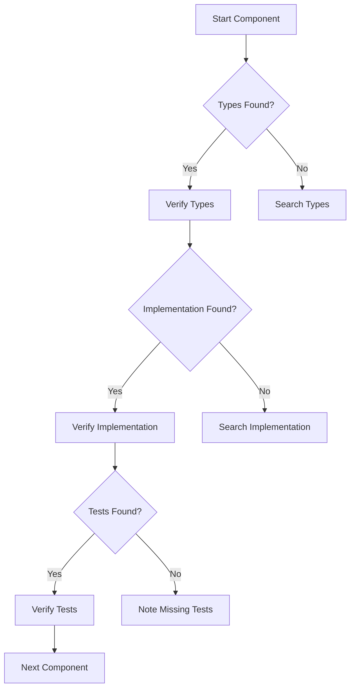

# Instructions for Cascade

## Quick Reference
- Primary Tracking File: alignment_tasks.md
- Current Phase: Type System Alignment
- Time Budget: 1-2 hours per task

## Core Rules
1. NEVER mark a task as complete without verification
2. Track ALL progress in alignment_tasks.md ONLY
3. Run verification BEFORE updating any status
4. Stay focused on current task until verified

## Verification Process
1. For Type Changes:
   ```bash
   # REQUIRED: Run tsc on modified file
   npx tsc --noEmit path/to/changed/file.ts
   
   # REQUIRED: Run tsc on dependent files
   npx tsc --noEmit path/to/dependent1.ts path/to/dependent2.ts
   
   # REQUIRED: Document verification results in task file
   ```

2. Status Updates:
   ```markdown
   # ALWAYS include these in status updates:
   - [ ] Pre-change tsc results
   - [ ] Changes made
   - [ ] Post-change tsc results
   - [ ] Dependent file impacts
   ```

3. Task Completion Requirements:
   - Clean tsc run on changed file
   - Clean tsc run on dependent files
   - All changes documented
   - Status updated in tracking file

## Task Status Markers
- In Progress: Currently being worked on
- Complete: Verified with tsc
- Pending: Not started
- Blocked: Waiting on dependencies
- Failed: Attempted but has errors

## Task File Format
```markdown
### [Component Name]
Status: [Marker]
File: path/to/file
Pre-Change tsc:
  - [Error details if any]
Changes Made:
  - [List of changes]
Post-Change tsc:
  - [Verification results]
Dependencies:
  - [List of dependent files]
```

## Task Workflow

### 1. Pre-Task Checklist
- [ ] Check Quick Reference in all files
- [ ] Verify pre-requisites completed
- [ ] Identify files to analyze using Type Mapping Matrix
- [ ] Review completion criteria

### 2. Analysis Process
1. File Discovery
   ```powershell
   # Find type definitions
   codebase_search "interface|type|enum" "src/types"
   
   # Find implementations
   grep_search -Query "implements|extends|satisfies" -Path "src/**/*.ts"
   
   # Find type imports
   grep_search -Query "import.*type.*from" -Path "src/**/*.ts"
   ```

2. Code Analysis
   ```powershell
   # View type definitions
   view_file "src/types/[component].ts"
   
   # View implementations
   view_code_item "src/client/[path]" "ComponentName"
   
   # Find related files
   related_files "src/types/[component].ts"
   ```

3. Type Verification Steps
   ```bash
   # Initial Type Check
   npx tsc --noEmit
   ```

### 3. Common Type Issues
1. Type Mismatches
   ```typescript
   // Client
   interface UserData { id: number }
   // Server
   interface UserData { id: string } // Type mismatch
   ```

2. Missing Properties
   ```typescript
   // Shared
   interface Config { debug: boolean, timeout: number }
   // Implementation
   const config: Config = { debug: true } // Missing timeout
   ```

3. Nullability Issues
   ```typescript
   // Client
   type Data = { value: string | null }
   // Server
   type Data = { value: string } // Missing null case
   ```

### 4. Verification Commands
```powershell
# Find type definition files
Get-ChildItem -Path "src" -Filter "*.types.ts" -Recurse

# Search for type usage
Select-String -Path "src/**/*.ts" -Pattern "implements|extends|satisfies"

# Find type imports
Select-String -Path "src/**/*.ts" -Pattern "import.*type.*from"

# Check for type errors
Get-ChildItem -Path "src" -Filter "*.ts" -Recurse | ForEach-Object {
    Write-Output "Checking $_..."
    Select-String -Path $_ -Pattern "any|unknown"
}
```

## Type Verification Process

### Before Starting Any Fix
1. ALWAYS check both tracking files first:
   - alignment_tasks.md: Current task list and progress
   - alignment_analysis.md: Dependency tree and error status

2. Update tracking files BEFORE making changes:
   - Mark which file you're working on
   - Update "Current Focus" section
   - Note any dependencies or blockers

### During Fix Process
1. For each file:
   ```markdown
   a. Document current state:
      - Run `tsc --noEmit` on the file
      - List all errors in alignment_tasks.md
      - Update error count in both tracking files
   
   b. Before making changes:
      - Mark task as "In Progress" 
      - Note start time and expected changes
   
   c. After making changes:
      - Run `tsc --noEmit` to verify fix
      - Update both tracking files:
        * Mark task as "Fixed" or "Failed" 
        * Update error counts
        * Note any new errors found
   ```

2. For dependent files:
   ```markdown
   a. Check dependency tree in alignment_analysis.md
   b. Only start if all dependencies are fixed
   c. Update "Blocked by" status if needed
   ```

### Verification Steps
1. NEVER mark a task as complete without:
   - Running `tsc --noEmit`
   - Updating both tracking files
   - Checking dependent files

2. For each fix:
   ```bash
   # First, check the specific file
   npx tsc --noEmit path/to/file.ts
   
   # Then, check all related files
   npx tsc --noEmit path/to/file.ts path/to/dependent1.ts path/to/dependent2.ts
   ```

### Progress Tracking Rules
1. ALWAYS keep both files in sync:
   - alignment_tasks.md: Task status
   - alignment_analysis.md: Dependency and error status

2. Use consistent status markers:
   - Pending: Not started
   - : Currently working
   - : Verified with tsc
   - : Fix attempted but failed
   - : Waiting on dependencies

3. Update counts after EVERY change:
   - Total errors
   - Fixed errors
   - Remaining errors
   - Files in each status

4. Document all changes:
   ```markdown
   File: path/to/file.ts
   Status: -> 
   Fixed Errors: 2
   Remaining: 1
   New Issues: None
   ```

### Quality Gates
1. NEVER proceed without:
   - Clean tsc run on changed file
   - Updated tracking files
   - Checked dependent files

2. ALWAYS verify fixes with:
   ```bash
   # Check specific file
   npx tsc --noEmit path/to/file.ts
   
   # Check with dependencies
   npx tsc --noEmit path/to/file.ts path/to/dependent1.ts
   ```

3. If new errors found:
   - Document immediately
   - Update status to 
   - Add to task list
   - Update dependency tree

### 1. Initial Type Check
```bash
npx tsc --noEmit
```
- Run this command first to get a complete picture of type errors
- Document all errors in alignment_analysis.md
- Categorize errors by service/component

### 2. Error Analysis
For each error:
1. Identify the root cause
2. Check related files for similar patterns
3. Document in alignment_analysis.md:
   - Error description
   - Affected files
   - Proposed solution

### 3. Type Resolution Steps
1. Fix type definition errors first
2. Address implementation errors
3. Resolve interface mismatches
4. Fix type assertion issues
5. Add missing type guards
6. Verify fixes with `tsc --noEmit`

### 4. Service-Level Verification
For each service:
1. Check type imports
2. Verify interface implementations
3. Validate event type usage
4. Test type narrowing
5. Document in alignment_tasks.md

### 5. Cross-Component Verification
1. Check type consistency between:
   - Client and server
   - Services and shared types
   - Event handlers and listeners
2. Verify type propagation
3. Test edge cases

### 6. Final Verification
1. Run `tsc --noEmit` again
2. Update status in alignment_analysis.md
3. Document any remaining issues
4. Create follow-up tasks if needed

## Gateway Checks
1. Always run `tsc --noEmit` before marking task complete
2. Never proceed without fixing critical type errors
3. Document all type-related decisions
4. Keep alignment_analysis.md updated

## Progress Tracking
1. Use alignment_analysis.md for status
2. Track errors by component
3. Monitor fix progress
4. Document verification steps

## Gateway Checks & Continuation Criteria

### Gateway Checks
Each gateway must pass before proceeding:

1. Type Definition Gateway
   ```powershell
   # Check if type definitions exist
   $typeFiles = Get-ChildItem -Path "src/types" -Filter "*.ts" -Recurse
   if ($typeFiles) {
       # Continue to implementation check
       return $true
   }
   ```

2. Implementation Gateway
   ```powershell
   # Verify implementations exist
   $implCount = Select-String -Path "src/**/*.ts" -Pattern "implements|extends" | Measure-Object | Select-Object -ExpandProperty Count
   if ($implCount -gt 0) {
       # Continue to usage check
       return $true
   }
   ```

3. Usage Gateway
   ```powershell
   # Confirm type usage
   $usageCount = Select-String -Path "src/**/*.ts" -Pattern "import.*type.*from" | Measure-Object | Select-Object -ExpandProperty Count
   if ($usageCount -gt 0) {
       # Continue to next component
       return $true
   }
   ```

### Continuation Rules
1. Auto-Continue When:
   - All gateway checks pass
   - No blocking issues found
   - Previous component verified
   - Documentation updated

2. No User Input Required For:
   - Moving to next file in component
   - Running verification commands
   - Updating documentation
   - Minor type fixes

3. Stop Only When:
   - Critical type mismatch found
   - Missing core type definitions
   - Circular type dependencies
   - Performance impact detected

4. Auto-Resolution Patterns:
   ```typescript
   // 1. Optional Properties
   if (clientType.optional && !serverType.optional) {
       makeOptional(serverType)
   }

   // 2. Null Handling
   if (clientType.nullable && !serverType.nullable) {
       addNullability(serverType)
   }

   // 3. Type Widening
   if (isSubtype(clientType, serverType)) {
       widenType(serverType)
   }
   ```

5. Progress Indicators:
   - Types Verified: number/total
   - Files Checked: number/total
   - Issues Fixed: number/total
   - Components Complete: number/total

## CONTINUOUS PROGRESS RULES

### 1. NEVER:
- Ask for permission to continue
- Wait for confirmation to proceed
- Stop between related tasks
- Leave work incomplete
- Break dependency order

### 2. ALWAYS:
- Continue to next task automatically
- Follow dependency resolution order
- Complete all related changes
- Update tracking after each change
- Maintain forward progress

### 3. Task Flow:
```markdown
1. Complete current task fully
2. Update tracking files
3. Identify next unblocked task
4. Proceed immediately
5. Repeat until all tasks complete
```

### 4. Progress Requirements:
- Work continuously through tasks
- Follow dependency order strictly
- Document all changes immediately
- Verify each change thoroughly
- Move to next task automatically

### 5. Completion Criteria:
Only stop when:
- All tasks are complete
- No more unblocked tasks exist
- Critical error prevents progress
- User explicitly requests stop

## Cascade-Specific Optimizations

### Tool Usage Patterns
```typescript
interface ToolPattern {
    task: string
    tools: Tool[]
    order: number
    autoProgress: boolean
}

const patterns: ToolPattern[] = [
    {
        task: "Find Type Definitions",
        tools: ["codebase_search", "grep_search"],
        order: 1,
        autoProgress: true
    },
    {
        task: "Check Implementations",
        tools: ["view_file", "view_code_item"],
        order: 2,
        autoProgress: true
    },
    {
        task: "Find Related Files",
        tools: ["related_files"],
        order: 3,
        autoProgress: true
    }
]
```

### Search Optimization
```powershell
# 1. Type Definition Search
codebase_search "interface|type|enum|class" "src/types"

# 2. Implementation Search
grep_search -Query "(implements|extends|new)" -Path "src/**/*.ts"

# 3. Usage Search
grep_search -Query "import.*from.*types" -Path "src/**/*.ts"
```

### File View Strategy
```typescript
interface ViewStrategy {
    priority: 'type' | 'impl' | 'test'
    maxLines: number
    skipPatterns: string[]
}

const strategies = {
    type: {
        priority: 'type',
        maxLines: 200,
        skipPatterns: ['// @internal', '// @deprecated']
    },
    impl: {
        priority: 'impl',
        maxLines: 100,
        skipPatterns: ['console.log', 'debug']
    }
}
```

### Auto-Resolution Rules
```typescript
const autoResolutionRules = {
    nullability: {
        pattern: /(\w+)(?![\s\S]*\|.*null)/,
        fix: (type) => `${type} | null`
    },
    optionalProps: {
        pattern: /(\w+):\s*([^?])/,
        fix: (prop, type) => `${prop}?: ${type}`
    },
    arrayTypes: {
        pattern: /Array<([^>]+)>/,
        fix: (type) => `${type}[]`
    }
}
```

### Decision Tree


### Progress Tracking
```typescript
interface CascadeProgress {
    currentFile: string
    remainingFiles: string[]
    searchResults: Map<string, string[]>
    viewedFiles: Set<string>
    autoFixes: AutoFix[]
    decisions: Decision[]
}

interface Decision {
    type: 'continue' | 'stop' | 'fix'
    reason: string
    action?: string
}
```

### Tool Chaining
```typescript
const toolChains = {
    typeVerification: [
        'codebase_search',
        'view_file',
        'related_files'
    ],
    implementationCheck: [
        'grep_search',
        'view_code_item',
        'related_files'
    ],
    coverageAnalysis: [
        'grep_search',
        'view_file',
        'related_files'
    ]
}
```

### Error Recovery
```typescript
const errorRecovery = {
    searchFailed: () => {
        // Try alternative search patterns
        return ['type', 'interface', 'class'].map(pattern => 
            `codebase_search "${pattern}"`
        )
    },
    viewFailed: (file) => {
        // Try related files
        return `related_files "${file}"`
    },
    typeMismatch: (type) => {
        // Auto-fix common issues
        return autoResolutionRules[type].fix
    }
}
```

### Performance Optimization
1. Search Strategy
   - Start with specific directories
   - Use targeted file patterns
   - Cache search results

2. View Strategy
   - View only relevant sections
   - Skip known boilerplate
   - Cache viewed files

3. Analysis Strategy
   - Batch similar operations
   - Reuse search results
   - Track dependencies

## Cascade Operation Patterns

1. Sequential Analysis
```typescript
const analysisFlow = {
    // Start with type definitions
    typeSearch: {
        tool: 'codebase_search',
        pattern: 'interface|type|enum|class',
        target: 'src/types',
        autoProgress: true
    },
    // Move to implementations
    implSearch: {
        tool: 'grep_search',
        pattern: '(implements|extends|new)',
        target: 'src/**/*.ts',
        autoProgress: true
    },
    // Check usage
    usageSearch: {
        tool: 'grep_search',
        pattern: 'import.*from.*types',
        target: 'src/**/*.ts',
        autoProgress: true
    }
}
```

2. Caching Strategy
```typescript
interface CacheStrategy {
    searchResults: {
        [pattern: string]: string[]
        ttl: number  // Time to live in ms
    }
    viewedFiles: {
        [file: string]: {
            content: string
            timestamp: number
        }
    }
    typeDefinitions: {
        [type: string]: {
            location: string
            dependencies: string[]
        }
    }
}
```

3. Auto-Resolution Matrix
```typescript
const resolutionMatrix = {
    typeIssues: {
        nullability: {
            detect: (type: string) => !type.includes('null'),
            fix: (type: string) => `${type} | null`,
            autoApply: true
        },
        optionalProps: {
            detect: (prop: string) => !prop.includes('?'),
            fix: (prop: string) => prop.replace(':', '?:'),
            autoApply: true
        },
        arrayTypes: {
            detect: (type: string) => type.includes('Array<'),
            fix: (type: string) => type.replace('Array<', '').replace('>', '[]'),
            autoApply: true
        }
    }
}
```

4. Decision Making Flow
```typescript
interface DecisionFlow {
    current: {
        file: string
        task: string
        progress: number
    }
    next: {
        action: 'continue' | 'stop' | 'fix'
        reason: string
        priority: number
    }
    history: {
        decisions: Decision[]
        timestamp: number
    }
}
```

5. Tool Usage Optimization
```typescript
const toolOptimization = {
    codebase_search: {
        maxResults: 50,
        priorityDirs: ['src/types', 'src/api'],
        cacheTime: 5000  // ms
    },
    grep_search: {
        batchSize: 20,
        fileTypes: ['ts', 'tsx'],
        excludePatterns: ['node_modules', 'dist']
    },
    view_file: {
        maxLines: 200,
        skipComments: true,
        focusTypes: true
    }
}
```

6. Progress Rules
```typescript
const progressRules = {
    autoAdvance: {
        conditions: [
            'typesVerified',
            'noBlockingIssues',
            'documentationUpdated'
        ],
        exceptions: [
            'criticalMismatch',
            'missingCore',
            'circularDependency'
        ]
    },
    autoFix: {
        allowed: [
            'nullability',
            'optionalProps',
            'arrayTypes'
        ],
        blocked: [
            'genericTypes',
            'complexTypes',
            'customTypes'
        ]
    }
}
```

7. Efficiency Patterns
```typescript
const efficiency = {
    batchOperations: {
        search: true,
        fileView: true,
        typeCheck: true
    },
    cacheStrategy: {
        searchResults: true,
        fileContents: true,
        typeDefinitions: true
    },
    skipPatterns: [
        'test files when checking implementations',
        'comments and docs when searching',
        'generated files',
        'third-party types'
    ]
}
```

These patterns ensure Cascade:
1. Works systematically through files
2. Caches results for efficiency
3. Auto-resolves common issues
4. Makes clear decisions
5. Optimizes tool usage
6. Maintains progress
7. Skips unnecessary work

## Cascade Process Guidelines

## REQUIRED Process Steps

### 1. Before ANY Action
```markdown
1. CHECK tracking files:
   - [ ] alignment_tasks.md - Current tasks and progress
   - [ ] alignment_analysis.md - Dependencies and status

2. VERIFY current state:
   - [ ] Run necessary tool commands
   - [ ] Document current status
   - [ ] Note any blockers

3. UPDATE tracking BEFORE changes:
   - [ ] Mark task as "In Progress"
   - [ ] Note dependencies
   - [ ] Update both tracking files
```

### 2. During Changes
```markdown
1. FOLLOW dependency order:
   - [ ] Check dependency tree
   - [ ] Verify no blockers
   - [ ] Note any dependent files

2. MAKE changes systematically:
   - [ ] One file at a time
   - [ ] Document each change
   - [ ] Run verification after each change

3. VERIFY changes immediately:
   - [ ] Run tsc --noEmit
   - [ ] Check dependent files
   - [ ] Document any new issues
```

### 3. After Changes
```markdown
1. UPDATE tracking files:
   - [ ] Update task status
   - [ ] Update error counts
   - [ ] Note any new issues

2. VERIFY completion:
   - [ ] Run final verification
   - [ ] Check dependent files
   - [ ] Update dependency tree

3. DOCUMENT results:
   - [ ] Note all changes made
   - [ ] Update progress summary
   - [ ] Plan next steps
```

## ERROR PREVENTION Rules

### 1. NEVER:
- Skip verification steps
- Make parallel changes
- Ignore dependency order
- Leave tracking files outdated
- Proceed with blockers
- Skip error documentation

### 2. ALWAYS:
- Check both tracking files first
- Update status before changes
- Verify after each change
- Document all errors found
- Follow dependency order
- Keep tracking files in sync

### 3. REQUIRED Verifications:
```bash
# 1. Before changes
npx tsc --noEmit [file]

# 2. After each change
npx tsc --noEmit [file]

# 3. With dependencies
npx tsc --noEmit [file] [dependent-files]
```

## TRACKING Requirements

### 1. Tasks File (alignment_tasks.md)
```markdown
- Current task status
- Error counts
- Progress tracking
- Next steps
```

### 2. Analysis File (alignment_analysis.md)
```markdown
- Dependency tree
- Error analysis
- Blocking issues
- Component status
```

## QUALITY GATES

### 1. Before Starting Task:
- [ ] Both tracking files reviewed
- [ ] Current state documented
- [ ] Dependencies checked
- [ ] No blockers present

### 2. During Task:
- [ ] Following dependency order
- [ ] Documenting all changes
- [ ] Verifying each change
- [ ] Updating tracking files

### 3. After Task:
- [ ] All verifications passed
- [ ] Tracking files updated
- [ ] Dependencies checked
- [ ] Next steps documented

## ERROR HANDLING

### 1. When Error Found:
```markdown
1. STOP immediately
2. DOCUMENT error:
   - File location
   - Error message
   - Related dependencies
3. UPDATE tracking:
   - Mark status
   - Note blockers
   - Update counts
4. PLAN resolution:
   - Check dependencies
   - Note required fixes
   - Update task order
```

### 2. When Fix Fails:
```markdown
1. REVERT to known good state
2. UPDATE tracking files
3. DOCUMENT failure
4. REASSESS approach
```

## PROGRESS TRACKING

### 1. Required Status Updates:
```markdown
- Before starting work
- After each change
- When finding errors
- After verification
- Before moving to next task
```

### 2. Required Counts:
```markdown
- Total errors
- Fixed errors
- Remaining errors
- Blocked tasks
- Dependencies affected
```

### 3. Required Documentation:
```markdown
- All changes made
- Verification results
- New issues found
- Next steps
- Blocking issues
```

## Tool Usage Examples

### 1. Finding Type Definitions
```powershell
# Using codebase_search
codebase_search "interface APIRequest" "src/types"

# Using grep_search
grep_search -Query "type|interface" -Path "src/types/*.ts"
```

### 2. Checking Implementations
```powershell
# View type definition
view_file "src/types/api.types.ts" 0 100

# View implementation
view_code_item "src/client/api/client.ts" "APIClient"
```

### 3. Finding Related Files
```powershell
# Find all related files
related_files "src/types/api.types.ts"

# Check specific implementation
view_code_item "src/server/routes/api.ts" "APIHandler"
```

## Issue Resolution Guide

### 1. Type Mismatch
```typescript
// Problem
interface Client { value: string }
interface Server { value: number }

// Solution
interface Shared { value: string }
```

### 2. Missing Properties
```typescript
// Problem
interface Client { prop1: string }
interface Server { prop1: string, prop2: number }

// Solution
interface Shared {
    prop1: string
    prop2: number
}
```

### 3. Nullability
```typescript
// Problem
type Client = string | null
type Server = string

// Solution
type Shared = string | null
```

## Success Criteria
Each task must have:
1. All files analyzed using provided commands
2. Types verified using checklist
3. Implementation checked using examples
4. Documentation updated
5. Issues resolved using guides

## Progress Tracking
- Update Quick Reference in all files
- Document findings using templates
- Track issues using provided format
- Verify using provided commands
