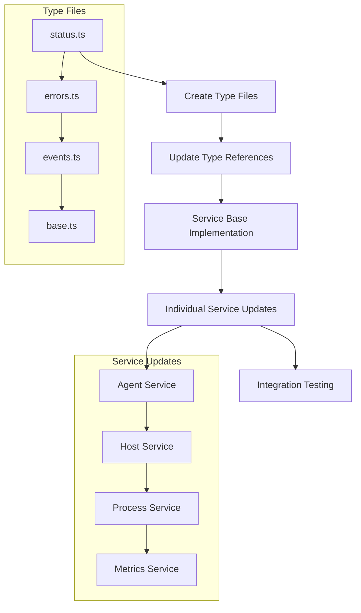

# Service Layer Alignment Guide

## Progress Tracking Rules

### Important Rules
1. ⚠️ ONLY mark a task as complete AFTER successful implementation and verification
2. ⚠️ NEVER mark progress before changes are committed and verified
3. ⚠️ Each task must pass ALL verification steps before marking as complete

### Progress Update Process
1. Implement changes
2. Run ALL verification steps
3. Fix any issues
4. Re-verify after fixes
5. ONLY THEN update progress

### Progress Marking Format
```markdown
Task [Number]: [Name]
Status: ✅ Complete
Verification:
- [x] Implementation done
- [x] All tests pass
- [x] TypeScript compiles
- [x] No any types
Files Changed:
- [filename1].ts
- [filename2].ts
Next Task: [Next Task Name]
```

## Implementation Phases

### Phase 1: Type System Foundation
Current Status: 🔄 In Progress

#### Task 1.1: Create Base Type Files
Status: ✅ Completed
Files Created:
- [x] status.ts
- [x] errors.ts
- [x] events.ts
- [x] base.ts
- [x] metrics.ts
- [x] validation.ts
- [x] common.ts

Verification Steps:
- [x] Run TypeScript compiler on new files
- [x] Verify no any types
- [x] Check interface completeness

All type files have been created and verified for type safety and completeness. The foundation is now ready for implementing the service layer.

#### Task 1.2: Update Existing Type References
Status: ⏳ Pending
Files to Update:
- [ ] agent.types.ts
- [ ] host.types.ts
- [ ] process.types.ts
- [ ] metrics.types.ts
- [ ] notification.types.ts
- [ ] docker.types.ts

Verification Steps:
1. Check import statements
2. Verify type usage
3. Run TypeScript compiler

### Phase 2: Service Implementation
Current Status: ⏳ Pending

#### Task 2.1: Agent Service Alignment
Status: ⏳ Pending
Files:
- [ ] agent.service.ts
- [ ] agent.types.ts

Implementation Steps:
1. Implement IService interface
2. Add error handling
3. Update event system
4. Add metrics collection

Verification:
1. Type check
2. Run service tests
3. Verify error handling
4. Check event emission

#### Task 2.2: Host Service Alignment
Status: ⏳ Pending
Files:
- [ ] host.service.ts
- [ ] host.types.ts

Implementation Steps:
1. Implement IService interface
2. Add error handling
3. Update event system
4. Add metrics collection

Verification:
1. Type check
2. Run service tests
3. Verify error handling
4. Check event emission

[Continue similar sections for each service...]

## Notification System Refactor

### ✅ Phase 1: Initial Setup & Structure
- [x] Create modular directory structure
- [x] Move notification-related code to dedicated directory
- [x] Setup basic service interfaces

### ✅ Phase 2: Core Services Implementation
- [x] Create db.service.ts for database operations
- [x] Create batch.service.ts for batching notifications
- [x] Create delivery.service.ts for multi-channel delivery
- [x] Create preferences.service.ts for user preferences
- [x] Create main notifications.service.ts orchestrator
- [x] Integrate Zod validator from existing codebase

### ✅ Phase 3: Features & Integration
- [x] Implement database CRUD operations
- [x] Add batch notification processing
- [x] Add multi-channel delivery (Web, Desktop, Gotify)
- [x] Add user preferences management
- [x] Add proper error handling
- [x] Add event handling & Socket.IO integration

### 🔄 Phase 4: Testing & Documentation
- [ ] Add unit tests for each service
- [ ] Add integration tests
- [ ] Add end-to-end tests
- [ ] Update API documentation
- [ ] Add service architecture diagrams

### 🔄 Phase 5: Performance & Monitoring
- [ ] Optimize database queries
- [ ] Add performance metrics
- [ ] Add detailed logging
- [ ] Monitor batch processing efficiency
- [ ] Track delivery success rates

## Task Management Rules
1. NEVER proceed to the next task until current task is complete and verified
2. Each task requires:
   - File changes verification
   - Type checking confirmation
   - Test validation if applicable
3. Track progress in this document by updating completion status
4. If a task fails verification, fix it before proceeding

## File Map
```typescript
// New Type Definition Files
src/
  types/
    services/
      status.ts        // Service status enums
      errors.ts        // Error type definitions
      events.ts        // Event type definitions
      base.ts          // Base service interfaces
      metrics.ts       // Metrics interfaces
      validation.ts    // Validation types
      common.ts        // Shared types

// Service Implementation Files to Update
src/server/services/
  agent/
    agent.service.ts
    agent.types.ts
  host/
    host.service.ts
    host.types.ts
  process/
    process.service.ts
    process.types.ts
  metrics/
    metrics.service.ts
    metrics.types.ts
  notification/
    notification.service.ts
    notification.types.ts
  docker/
    docker.service.ts
    docker.types.ts
```

## Command Reference
```pwsh
# Create new type files
New-Item -Path "src/types/services" -ItemType Directory -Force

# Type check
npm run tsc -- --noEmit --strict

# Find any types
Get-ChildItem -Path "src/types/services" -Recurse -File | 
    Select-String -Pattern "any" -CaseSensitive

# Run tests
npm run test:services

# Check file contents
Get-Content -Path "src/types/services/status.ts"

# Check TypeScript errors
npm run tsc -- --noEmit | Select-String -Pattern "error TS"
```

## Task Dependencies Map


## Implementation Order Clarification

1. Type System (Phase 1)
   - ⏱️ Estimated time: 2-3 hours
   - 📋 Prerequisites: None
   - ✅ Success criteria: All type files compile

2. Type References (Phase 1)
   - ⏱️ Estimated time: 2-3 hours
   - 📋 Prerequisites: Type System complete
   - ✅ Success criteria: No any types remain

3. Service Base (Phase 2)
   - ⏱️ Estimated time: 3-4 hours
   - 📋 Prerequisites: Type References complete
   - ✅ Success criteria: Base class implements all interfaces

4. Service Updates (Phase 2)
   - ⏱️ Estimated time: 2-3 hours per service
   - 📋 Prerequisites: Service Base complete
   - ✅ Success criteria: Each service passes tests

## Task Completion Checklist

### Before Starting Task
- [ ] Read entire task description
- [ ] Verify dependencies
- [ ] Check required tools
- [ ] Understand success criteria

### During Task Execution
- [ ] Follow task steps exactly
- [ ] Run verification after each step
- [ ] Document any issues
- [ ] Fix problems immediately

### Before Moving to Next Task
- [ ] All verifications pass
- [ ] Progress updated
- [ ] Dependencies checked
- [ ] Documentation updated

## Type Definitions Reference

### Service Status Types (status.ts)
```typescript
export enum ServiceStatus {
  ACTIVE = 'active',
  INACTIVE = 'inactive',
  ERROR = 'error',
  INITIALIZING = 'initializing'
}

export enum HostStatus {
  ONLINE = 'online',
  OFFLINE = 'offline',
  ERROR = 'error',
  INSTALLING = 'installing'
}

export enum AgentStatus {
  INSTALLED = 'installed',
  ERROR = 'error',
  UNINSTALLED = 'uninstalled'
}

export enum ProcessStatus {
  RUNNING = 'running',
  STOPPED = 'stopped',
  STARTING = 'starting',
  STOPPING = 'stopping',
  ERROR = 'error'
}
```

### Error Types (errors.ts)
```typescript
export interface ServiceError {
  code: string;
  message: string;
  timestamp: Date;
  service: string;
  details?: Record<string, unknown>;
  stack?: string;
}

export interface ValidationError extends ServiceError {
  validationErrors: Array<{
    field: string;
    message: string;
  }>;
}

export interface ConnectionError extends ServiceError {
  retryable: boolean;
  lastAttempt: Date;
  attempts: number;
}
```

### Event Types (events.ts)
```typescript
export interface ServiceEvent<T = unknown> {
  type: string;
  payload: T;
  timestamp: Date;
  source: string;
}

export interface ProcessEvent extends ServiceEvent {
  hostId: string;
  processId: number;
  status: ProcessStatus;
}

export interface MetricsEvent extends ServiceEvent {
  hostId: string;
  metrics: SystemMetrics;
  interval: number;
}
```

### Base Service Interface (base.ts)
```typescript
export interface IService {
  readonly name: string;
  readonly status: ServiceStatus;
  
  initialize(): Promise<void>;
  start(): Promise<void>;
  stop(): Promise<void>;
  healthCheck(): Promise<boolean>;
  
  on(event: string, handler: (event: ServiceEvent) => void): void;
  off(event: string, handler: (event: ServiceEvent) => void): void;
}

export interface IMetricsProvider {
  collectMetrics(): Promise<SystemMetrics>;
  getHistoricalMetrics(timeRange: TimeRange): Promise<SystemMetrics[]>;
  subscribeToMetrics(callback: (metrics: SystemMetrics) => void): void;
}
```

## Communication Layer Specifications

### WebSocket Event Standardization
```typescript
export interface WebSocketEvents {
  // Connection Events
  'connect': () => void;
  'disconnect': (reason: string) => void;
  'reconnect': (attemptNumber: number) => void;
  
  // Service Events
  'service:status': (status: ServiceStatus) => void;
  'service:error': (error: ServiceError) => void;
  
  // Process Events
  'process:start': (event: ProcessEvent) => void;
  'process:stop': (event: ProcessEvent) => void;
  
  // Metrics Events
  'metrics:update': (event: MetricsEvent) => void;
}
```

### Retry Mechanism
```typescript
export interface RetryConfig {
  maxAttempts: number;
  initialDelay: number;
  maxDelay: number;
  backoffFactor: number;
  timeout: number;
}

export interface RetryStrategy {
  shouldRetry(error: Error, attempt: number): boolean;
  getDelay(attempt: number): number;
}
```

### Circuit Breaker
```typescript
export interface CircuitBreakerConfig {
  failureThreshold: number;
  resetTimeout: number;
  monitorInterval: number;
  healthCheckInterval: number;
}

export interface CircuitBreakerMetrics {
  state: 'CLOSED' | 'OPEN' | 'HALF_OPEN';
  failures: number;
  lastFailure: Date | null;
  totalBreaks: number;
}
```

## Runtime Validation

### Input Validation
```typescript
export interface ValidationRule {
  field: string;
  type: 'string' | 'number' | 'boolean' | 'object' | 'array';
  required?: boolean;
  min?: number;
  max?: number;
  pattern?: RegExp;
  custom?: (value: any) => boolean;
}

export interface ValidationSchema {
  rules: ValidationRule[];
  options?: {
    stripUnknown?: boolean;
    allowUnknown?: boolean;
  };
}
```

### State Validation
```typescript
export interface StateValidation {
  checkState(): Promise<boolean>;
  validateTransition(from: ServiceStatus, to: ServiceStatus): boolean;
  validateOperation(operation: string): boolean;
}
```

## Error Recovery Procedures

### TypeScript Errors
1. Check error message
2. Locate file and line number
3. Verify type definitions
4. Fix type mismatches
5. Re-run compilation

### Runtime Errors
1. Check error stack trace
2. Locate error source
3. Add error handling
4. Add logging
5. Test fix

### Integration Errors
1. Check service communication
2. Verify event types
3. Check error propagation
4. Fix connection issues
5. Validate fixes

## Additional Implementation Details

### Connection Pooling
```typescript
export interface ConnectionPool {
  minConnections: number;
  maxConnections: number;
  idleTimeout: number;
  acquireTimeout: number;
  validateOnBorrow: boolean;
}
```

### Message Queue
```typescript
export interface MessageQueue {
  maxSize: number;
  retentionPeriod: number;
  priorityLevels: number;
  deadLetterQueue: boolean;
}
```

### Performance Monitoring
```typescript
export interface PerformanceMetrics {
  responseTime: number;
  throughput: number;
  errorRate: number;
  resourceUsage: {
    cpu: number;
    memory: number;
    connections: number;
  };
}
```

## Task Verification Checklist

### For Each File Creation:
1. ✓ File exists in correct location
   ```pwsh
   Test-Path "src/types/services/[filename]"
   ```

2. ✓ TypeScript compilation
   ```pwsh
   npm run tsc -- --noEmit "src/types/services/[filename]"
   ```

3. ✓ No any types
   ```pwsh
   Get-Content "src/types/services/[filename]" | 
       Select-String -Pattern "any" -CaseSensitive
   ```

4. ✓ Exports verification
   ```pwsh
   Get-Content "src/types/services/[filename]" | 
       Select-String -Pattern "^export "
   ```

### For Each Service Update:
1. ✓ Interface implementation
   ```pwsh
   Get-Content "src/server/services/[service]/[filename].ts" | 
       Select-String -Pattern "implements IService"
   ```

2. ✓ Error handling
   ```pwsh
   Get-Content "src/server/services/[service]/[filename].ts" | 
       Select-String -Pattern "try|catch|throw"
   ```

3. ✓ Event system
   ```pwsh
   Get-Content "src/server/services/[service]/[filename].ts" | 
       Select-String -Pattern "emit|on\(|addEventListener"
   ```

## File Operations

### File Creation
```pwsh
# Check if file exists
if (Test-Path "src/types/services/[filename]") {
    Write-Error "File already exists!"
    return
}

# Create directory if needed
New-Item -Path "src/types/services" -ItemType Directory -Force

# Create file
New-Item -Path "src/types/services/[filename]" -ItemType File -Force
```

### File Verification
```pwsh
# Content check
Get-Content "src/types/services/[filename]"

# Compilation check
npm run tsc -- --noEmit "src/types/services/[filename]"

# Export check
Get-Content "src/types/services/[filename]" | 
    Select-String -Pattern "^export"

# No any types check
Get-Content "src/types/services/[filename]" | 
    Select-String -Pattern "any" -CaseSensitive
```

### Service Updates
```pwsh
# Check current implementation
Get-Content "src/server/services/[service]/[filename].ts"

# Verify interface implementation
Get-Content "src/server/services/[service]/[filename].ts" | 
    Select-String -Pattern "implements IService"

# Check error handling
Get-Content "src/server/services/[service]/[filename].ts" | 
    Select-String -Pattern "try|catch|throw"

```
